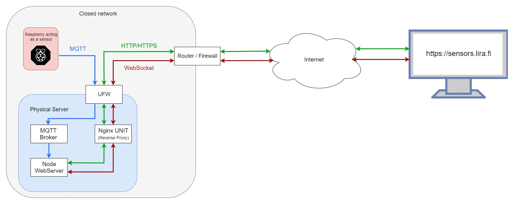

# sensors_server
This is small project made specially for job application.

Idea of this project was to connect IoT device from local network to Internet.

* Known Bugs:
  * Nginx Unit doesn't pass WebSocket calls through (does NOT affect performance)
